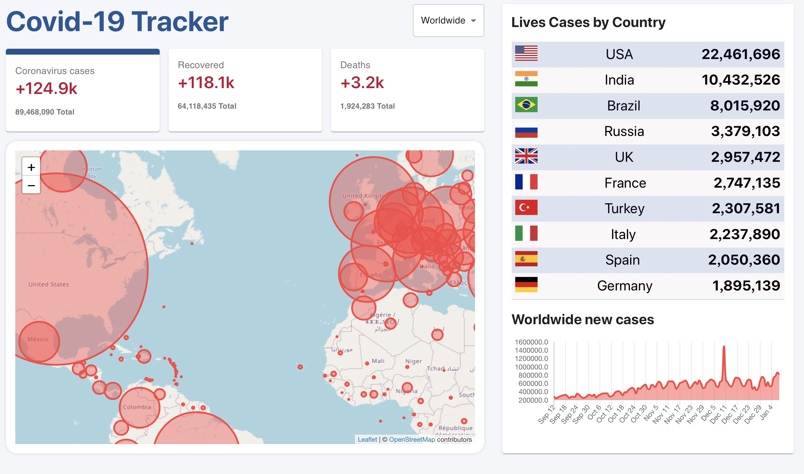

# COVID19-Tracker:
## Project Technology:
#### HTML, CSS, Boostrap, JavaScript, React, Material UI and Firebase.
## Description:
#### Enable to trace COVID 19( cases, recoved and deaths) by country and show all information in Map.
## [Link](https://covid-19-tracker-3bd27.web.app/?fbclid=IwAR0UrGtNMHWhkSnSpPiyOT38t385nbYMzfUgxnUgxq958Xiiac8zIGh2lC8)

# Getting Started with Create React App

This project was bootstrapped with [Create React App](https://github.com/facebook/create-react-app).

## Available Scripts

In the project directory, you can run:

### `npm start`

Runs the app in the development mode.\
Open [http://localhost:3000](http://localhost:3000) to view it in the browser.

The page will reload if you make edits.\
You will also see any lint errors in the console.

